# 🎤 Présentation

### Répartition des Tâches (Phase: BD NoSQL & Recommandation)

| Personne             | Tâches réaliser                                                                                                 |
|:---------------------|:----------------------------------------------------------------------------------------------------------------|
| **Benjamin Cornet**  | Déploiement / Readme / Schéma de données / Documentation / Creation des données MongoDB / Création noeuds neo4j |
| **Mathias Morel**    | Readme / Système de recommendation / Test MongoDB  / Création relation neo4j                                    |
| **Alwin Zawadski**   | Test du système de recommendation (validation)                                                                  |
| **Clément Goumzi**   | Schéma de données / Readme                                                                                      |
| **Simon Caillieret** | Synchronisation (Watcher -> change streams + pooling)                                                           |
| **Jules Andries**    | Schéma de données / Readme                                                                                      |
| **Clément Markwitz** | Système de recommendation / Déploiement                                                                         |
---


### 1️⃣ - Le schéma de la base de données **MongoDB**

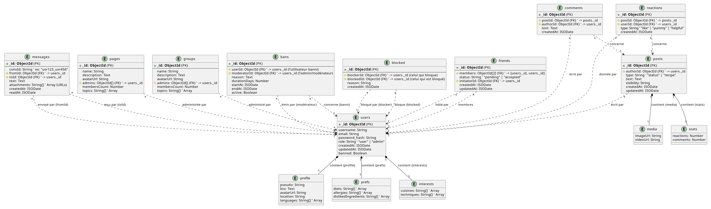

---

#### 📚 Collections principales :
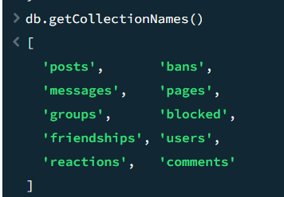

---

### 🔍 Exemple de requête simple (sélection)
Pour visualiser les utilisateurs qui ont réagi à un post :

```js
db.reactions.find(
  { postId: ObjectId("54d1a2b3c4d5e6f70908aa01") },
  { _id: 0, userId: 1 }
)
```

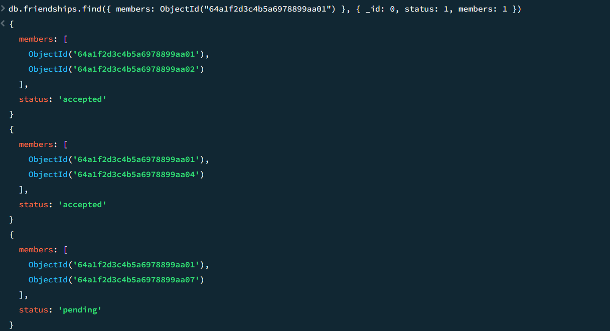

---

### 🧩 Exemple de jointure : lier groupes et utilisateurs

Cette requête montre le lien logique entre Groupes, Posts et Utilisateurs dans notre base MongoDB.

````js
db.groups.aggregate([
  { $match: { _id: ObjectId("c3c54f35b309480b82c35db7") } },

  // Posts publiés dans ce groupe
  { $lookup: {
      from: "posts",
      let: { gid: "$_id" },
      pipeline: [
        { $match: { $expr: { $eq: ["$groupId", "$$gid"] } } },
        { $project: { _id: 1, authorId: 1, text: 1, createdAt: 1 } }
      ],
      as: "posts_in_group"
  }},

  { $unwind: "$posts_in_group" },

  // Récupérer l'auteur du post
  { $lookup: {
      from: "users",
      localField: "posts_in_group.authorId",
      foreignField: "_id",
      as: "author"
  }},
  { $unwind: "$author" },

  // Nettoyage d'affichage
  { $project: {
      _id: 1,
      name: 1,
      "postId": "$posts_in_group._id",
      "postText": "$posts_in_group.text",
      "postAt": "$posts_in_group.createdAt",
      "authorId": "$author._id",
      "authorPseudo": "$author.profile.pseudo"
  }}
]);
````

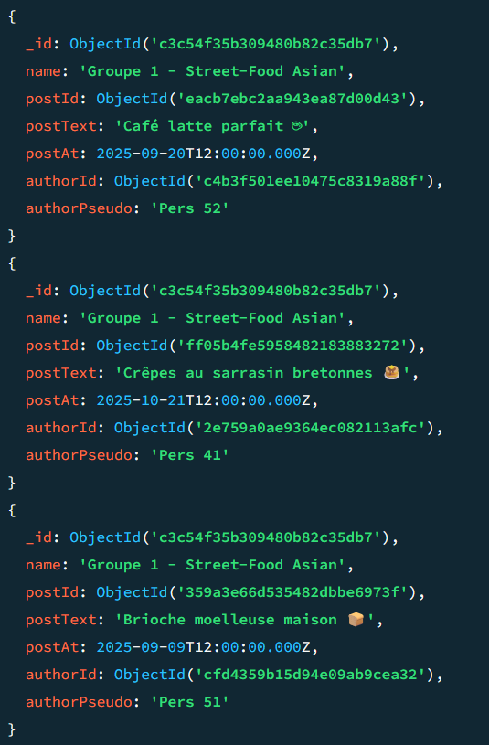

---

## 2️⃣ - Le schéma de la base de données **Neo4j**

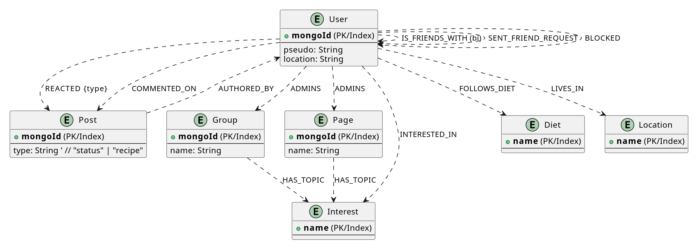

### 🧩 Structure du graphe :

Dans Neo4j, les entités de MongoDB deviennent des **noeuds** et les relations logiques deviennent des **arêtes**.

#### 🔹 Types de noeuds :
- `Users` : représente chaque utilisateur.
- `Groups` : représente un groupe culinaire.
- `Posts` : représente une publication.
- `Pages` : pages de communauté ou d'entreprise.
- `Diet`, `Interest`, `Location` : éléments de profil utilisateur.
- `Reactions`, `Comments` : interactions sociales.

#### 🔹 Types de relations :
- `(u1:Users)-[:IS_FRIENDS_WITH]-(u2:Users)` ->amitiés
- `(u:Users)-[:AUTHORED_BY]->(p:Posts)` ->auteur d'un post
- `(u:Users)-[:MEMBER_OF]->(g:Groups)` ->appartenance à un groupe
- `(u:Users)-[:INTERESTED_IN]->(i:Interest)` ->centres d'intérêt
- `(u:Users)-[:FOLLOWS_DIET]->(d:Diet)` ->régime suivi
- `(u:Users)-[:BLOCKED]->(u2:Users)` ->blocage

---

## 3️⃣ - Test sur Neo4j (graphe à N niveaux)

### 🎯 Objectif :
Montrer les connexions sociales d'un utilisateur à travers plusieurs niveaux :
amis -> amis d'amis -> groupes communs -> posts partagés.

### 💻 Exemple de requête Cypher :

### 🛠️ Préparer des paramètres dans Neo4j Browser
> Dans Neo4j Browser, on définis d'abord les variables :

```cypher
:param uid => "277b83705ccc42f1bfd9a1e6";
:param N => 3;
```

#### 1) 🌐 Amis à N niveaux (niveaux 1..N)

````cypher
MATCH (u:Users {mongo_id: $uid})-[rels:IS_FRIENDS_WITH*1..3]-(v:Users)
WHERE size(rels) <= $N
RETURN u, v, rels
LIMIT 300;
````

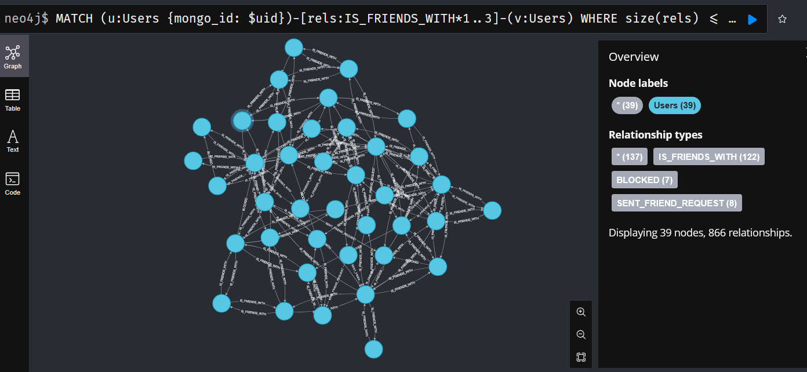

#### 2) 🎛️ Amis potentiels avec intérêts communs

````cypher
MATCH (u:Users {mongo_id: $uid})-[:IS_FRIENDS_WITH*1..3]-(v:Users)
MATCH (u)-[:INTERESTED_IN]->(i:Interest)<-[:INTERESTED_IN]-(v)
RETURN u, v, collect(DISTINCT i) AS commonInterests
ORDER BY size(commonInterests) DESC
LIMIT 100
````

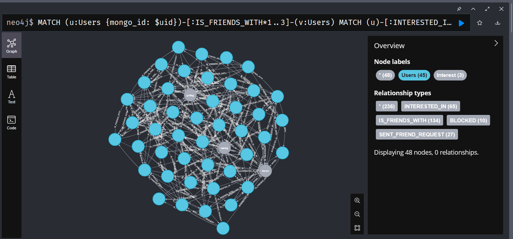

#### 3) 📰 Posts écrits par les amis (jusqu'à N)

````cypher
MATCH p = (u:Users {mongo_id: $uid})-[:IS_FRIENDS_WITH*1..$N]-(v:Users)
MATCH (post:Posts)-[:AUTHORED_BY]->(v)
RETURN p, post
LIMIT 200
````

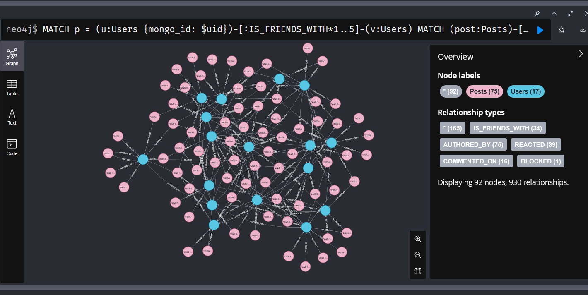

## 4️⃣ - Conception du système de recommandation
### 🧠 Principe général :

Le système de recommandation s'appuie sur les connexions dans le graphe **Neo4j** pour proposer :

- des amis (selon amis communs, régimes, intérêts…)

- des posts (aimés par des amis)

- des pages (gérées par des amis ou liées aux intérêts)

- ***⚙️ Requête de recommandation d'amis (Cypher)*** :

````cypher
MATCH (u1:Users {mongo_id: $user_mongo_id})
MATCH (u2:Users)
WHERE u1 <> u2 AND NOT (u1)-[:IS_FRIENDS_WITH]-(u2)

OPTIONAL MATCH (u1)-[:IS_FRIENDS_WITH]-(cf:Users)-[:IS_FRIENDS_WITH]-(u2)
WITH u1, u2, COLLECT(DISTINCT cf) AS commonFriends

OPTIONAL MATCH (u1)-[:FOLLOWS_DIET]-(cd:Diet)-[:FOLLOWS_DIET]-(u2)
WITH u1, u2, commonFriends, COLLECT(DISTINCT cd) AS commonDiets

OPTIONAL MATCH (u1)-[:MEMBER_OF]-(cg:Groups)-[:MEMBER_OF]-(u2)
WITH u1, u2, commonFriends, commonDiets, COLLECT(DISTINCT cg) AS commonGroups

OPTIONAL MATCH (u1)-[:INTERESTED_IN]-(ci:Interest)-[:INTERESTED_IN]-(u2)
WITH u1, u2, commonFriends, commonDiets, commonGroups, COLLECT(DISTINCT ci) AS commonInterests

OPTIONAL MATCH (u1)-[:LIVES_IN]-(cl:Location)-[:LIVES_IN]-(u2)
WITH u1, u2, commonFriends, commonDiets, commonGroups, commonInterests, COLLECT(DISTINCT cl) AS commonLocation

WITH u2,
     (size(commonFriends) * 2.0) AS friendScore,
     (size(commonDiets) * 1.5) AS dietScore,
     (size(commonGroups) * 1.5) AS groupScore,
     (size(commonInterests) * 1.0) AS interestScore,
     (size(commonLocation) * 0.5) AS locationScore

WITH u2.profile_pseudo AS candidateName, 
     u2.mongo_id AS candidateId,
     (friendScore + dietScore + groupScore + interestScore + locationScore) AS totalScore

WHERE totalScore > 0
RETURN candidateName, candidateId, totalScore
ORDER BY totalScore DESC
LIMIT 10
````

##### 🧩 Explication :

Cette requête évalue plusieurs critères :

- Amis communs (pondérés ×2)

- Régimes alimentaires similaires

- Groupes partagés

- Centres d'intérêt communs

On somme ces scores pour établir une note **globale de similarité**, puis on retourne les 10 meilleurs candidats.

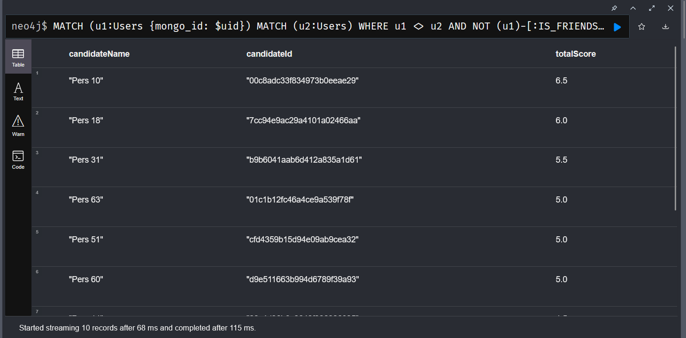

### Exemple de test avec api : 

Pondération multi-critères :
- Amis communs ->**×2.0**
- Groupes communs ->**×1.5**
- Régimes communs ->**×1.5**
- Intérêts communs ->**×1.0**
- Localisation commune ->**×0.5**

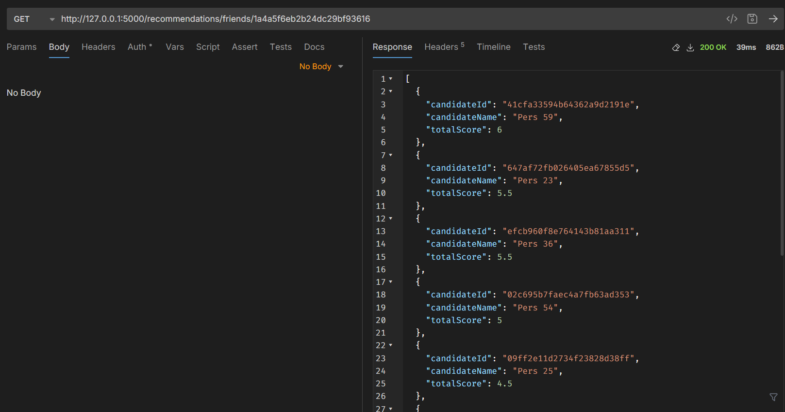
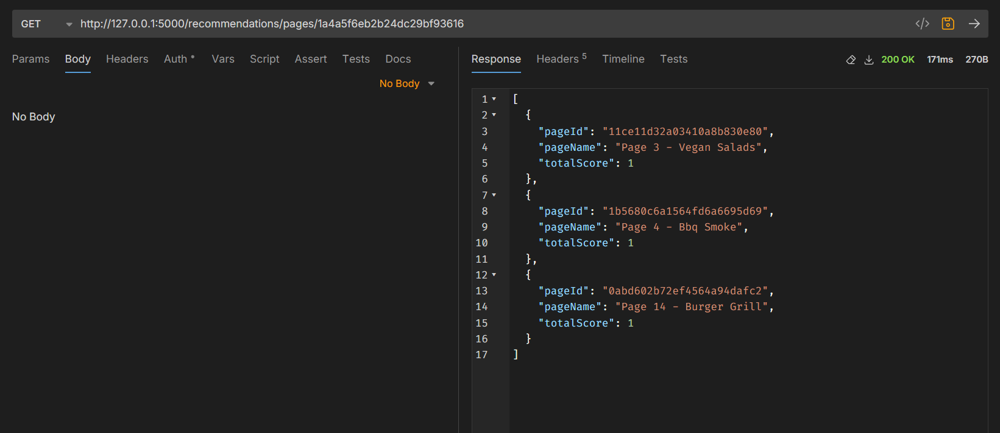

- **Poids 2.0** : Nombre d'Amis Administrant la Page ([:IS_FRIENDS_WITH] + [:ADMINS])

- **Poids 1.0**: Nombre d'Intérêts Communs entre l'Utilisateur et la Page ([:INTERESTED_IN] + [:HAS_TOPIC])

- **Exclusion**: Pages déjà Administrées par l'Utilisateur

- **Limite**: Top 10 Pages

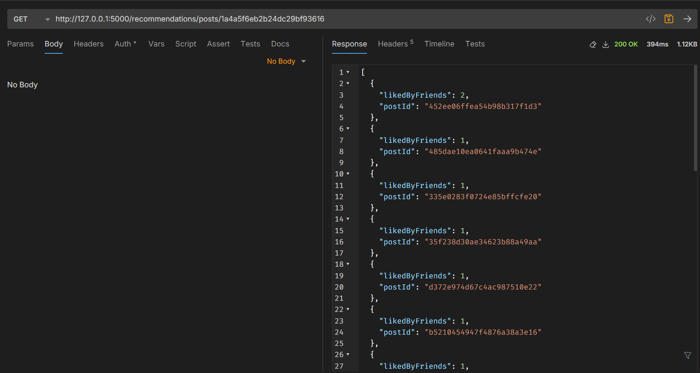

- **Critère Principal** : Nombre d'Amis ayant Réagi Positivement ([:REACTED] avec type like ou yummy)

- **Exclusions**: Posts déjà Réagis ou Authored par l'Utilisateur

- **Filtrage Anti-Blocage**: Exclure les posts d'auteurs bloqués

- **Limite**: Top 20 Posts

### 5️⃣ - Évaluation du système de recommandation
#### 🎯 Objectif :

Mesurer la qualité du moteur de recommandation d'amis (ou de posts) à partir de données :
- **Precision@10** : parmi les 10 suggestions proposées, combien sont correctes.
- **Recall@10** : parmi toutes les vraies relations créées, combien ont été prédites.

#### ⚙️ Étapes :

***Vérité terrain (ground truth)***
- -> les amitiés réellement créées entre deux dates.

***Prédictions***
- -> les recommandations que le système aurait proposées à t1.

---

### 📊 Résultats obtenus

```json
{
  "metrics": {
    "mean_precision_at_10": 3.8888888888888897,
    "mean_precision_at_10_pct": "3.89%",
    "mean_recall_at_10": 14.351851851851851,
    "mean_recall_at_10_pct": "14.35%"
  }
}
```

- Pour évaluer notre système, on a comparé les amitiés créées entre deux dates avec celles que notre moteur aurait recommandées à t1.

- On obtient une précision **moyenne de 3.9 %** et un rappel de **14.3 %**, ce qui montre que certaines suggestions sont justes, mais le système pourrait être amélioré.

- C'est une première version du moteur, et ces chiffres servent de base pour ajuster les poids des critères (amis communs, groupes, intérêts, etc.).

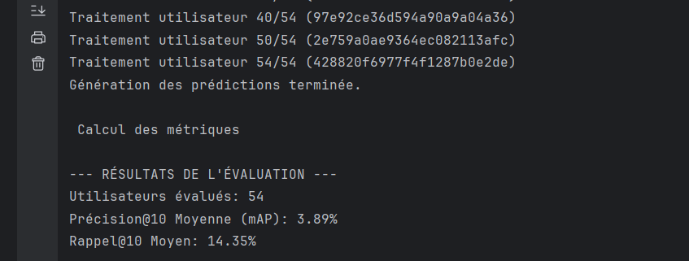

--- 

# Readme Projet : 

# 🍳 Projet de Recommandation - Réseau Culinaire

Un système de recommandation basé sur **MongoDB**, **Neo4j** et **Flask**, déployable via **Docker Compose**, **Podman** ou **Nomad**.

---

## 📋 Sommaire
1. [Présentation du projet](#-projet-de-recommandation---réseau-culinaire)
2. [Installation locale (Windows / Linux)](#-installation-locale)
3. [Lancement avec Docker Compose](#-lancement-avec-docker-compose)
4. [Lancement avec Nomad](#-déploiement-via-nomad)
5. [Structure MongoDB](#-schéma-mongodb)
6. [Schéma Neo4j](#-schéma-neo4j)
7. [Système de Recommandation](#-système-de-recommandation)
8. [Tests et Évaluation](#-tests-et-évaluation)
9. [Structure du dépôt](#-structure-du-dépôt)
10. [Tableau de répartition des tâches](#répartition-des-tâches-phase-bd-nosql--recommandation)

---

## 💻 Installation locale

### 🪟 Sous Windows
```bash
python -m venv venv
.venv\Scripts\Activate.ps1
python -m pip install --upgrade pip
python -m pip install -r requirements.txt
```

### 🐧 Sous Linux / Mac
```bash
python -m venv venv
source venv/bin/activate
python -m pip install --upgrade pip
python -m pip install -r requirements.txt
```

Avant de lancer l'application, assurez-vous que **MongoDB** et **Neo4j** sont en cours d'exécution localement.

> N'oublier pas de vous connecter a votre base de donnée Neo4j en vous connectant a l'adresse : `bolt://localhost:7474` avec l'utilisateur `neo4j` et le mot de passe `neo4j`.
> Changer le mot de passe lors de la première connexion -> neo4jtest 

Ensuite lancer le fichier **main.py** en cliquant sur le bouton "Run" de votre IDE ou en ligne de commande :
```bash
python main.py
```

Ensuite faite cette commande pour transformer le .env en variable d'environnement
```bash
cp .env.example .env
```


---

## 🐳 Lancement avec Docker Compose

### 1. Construire et lancer tous les services :
```bash
docker compose up -d
```

### 2. Accès aux services :
| Service | Port | Description |
|----------|------|-------------|
| Flask API | `http://votre-adresse-ip:5000` | API principale |
| MongoDB | `mongodb://votre-adresse-ip:27017` | Base de données source |
| Neo4j | `http://votre-adresse-ip:7474` | Interface Neo4j Browser |

### 3. Exemple de vérification :
- Exemple de recommendation pour un user :

```bash
curl http://votre-adresse-ip:5000/recommendations/friends/9a6f040941dd4a93a5da05e1
```

### 4. Exemple de vérification :
- Verifier l'url de la base dans mongoCompass :

```text
mongodb://votre-adress-ip:27017/?directConnection=true
```

### 5. Arrêter le projet :
```bash
docker compose down
```

## 🪶 Lancement avec Podman
```bash
podman compose up -d
```

### 1. Arrêter le projet :
```bash
podman compose down
```

### 2. Accès aux services :
| Service | Port | Description |
|----------|------|-------------|
| Flask API | `http://localhost:5000` | API principale |
| MongoDB | `mongodb://localhost:27017` | Base de données source |
| Neo4j | `http://localhost:7474` | Interface Neo4j Browser |

---

## 🚀 Déploiement via Nomad

### 1. Export des variables Nomad :
```bash
export NOMAD_ADDR=https://nomad.virtu.chez-wam.info/
export NOMAD_TOKEN=70f3d061-da6e-1e89-1496-259dbe1705be
```

### 2. Soumettre le job Nomad :
```bash
nomad job run recommandation.nomad
```

### 3. Arrêter le job :
```bash
nomad job stop recommendation-system
```

---

## 🍃 Schéma MongoDB

> Base principale "transactionnelle", stockant les utilisateurs, posts, relations, messages, etc.


Les collections principales :
- `users`
- `posts`
- `comments`
- `reactions`
- `groups`
- `pages`
- `friends`
- `blocked`
- `messages`
- `bans`

### Structure json des documents

#### 1 - users

```bash
{
  "_id": ObjectId,
  "username": "chef_dpoublm",
  "email": "chef.mamar@gmail.com",
  "password_hash": "pass_hash",
  "role": "user", // "user" | "admin"
  "profile": {
    "pseudo": "Chef Paul",
    "bio": "Passionné de cuisine italienne et végétarienne",
    "avatarUrl": "/uploads/avatars/paul.png",
    "location": "Lyon, France",
    "languages": ["fr", "en"]
  },
  "prefs": {
    "diets": ["vegetarian"],
    "allergies": ["gluten"],
    "dislikedIngredients": ["poivron"]
  },
  "interests": {
    "cuisines": ["italian", "french"],
    "techniques": ["fermentation", "grilling"]
  },
  "createdAt": ISODate("2025-02-12T10:20:00Z"),
  "updatedAt": ISODate("2025-11-03T15:00:00Z"),
  "banned": false
}
```

#### 2 - posts

```bash
{
  "_id": ObjectId,
  "authorId": ObjectId("..."), // ->users._id
  "type": "recipe", // "status" | "recipe"
  "text": "Ma nouvelle recette de risotto crémeux",
  "media": {
    "imageUrl": "/uploads/posts/risotto.jpg",
    "videoUrl": null
  },
  "visibility": "public",
  "stats": { "reactions": 15, "comments": 4 },
  "createdAt": ISODate("2025-11-03T14:00:00Z"),
  "updatedAt": ISODate("2025-11-03T14:10:00Z")
}
```

#### 3 - comments

```bash
{
  "_id": ObjectId,
  "postId": ObjectId("..."), // ->posts._id
  "authorId": ObjectId("..."), // ->users._id
  "text": "Super recette, merci !",
  "createdAt": ISODate("2025-11-03T14:30:00Z")
}
```

#### 4 - reactions

```bash
{
  "_id": ObjectId,
  "postId": ObjectId("..."),
  "userId": ObjectId("..."),
  "type": "like", // "like" | "yummy" | "helpful"
  "createdAt": ISODate("2025-11-03T14:32:00Z")
}
```

#### 5 - bans
```bash
{
  "_id": ObjectId,
  "userId": ObjectId("userBanni"),
  "moderatorId": ObjectId("admin1"),
  "reason": "Contenu inapproprié / non respect des règles",
  "durationDays": 30, // null ou 0 = permanent
  "startAt": ISODate("2025-11-01T09:00:00Z"),
  "endAt": ISODate("2025-12-01T09:00:00Z"),
  "active": true
}
```

#### 6 - messages
```bash
{
  "_id": ObjectId,
  "convId": "usr123_usr456",
  "fromId": ObjectId("..."),
  "toId": ObjectId("..."),
  "text": "Salut, tu pourrais m'envoyer la version vegan de ta recette ?",
  "attachments": [],
  "createdAt": ISODate("2025-11-03T12:00:00Z"),
  "readAt": null
}
```

#### 7 - pages
```bash
{
  "_id": ObjectId,
  "name": "Cuisine Italienne Authentique",
  "description": "Recettes et techniques de la cuisine italienne traditionnelle.",
  "avatarUrl": "/uploads/pages/italie.png",
  "admins": [ObjectId("...")],
  "membersCount": 1200,
  "topics": ["italian", "pasta", "sauce"]
}
```


#### 8 - groups

```bash
{
  "_id": ObjectId,
  "name": "Amateurs de Street Food",
  "description": "Partagez vos recettes et découvertes street food du monde entier.",
  "avatarUrl": "/uploads/groups/streetfood.png",
  "admins": [ObjectId("...")],
  "membersCount": 340,
  "topics": ["street-food", "asian", "fusion"]
}

```

#### 9 - blocked

```bash
{
  "_id": ObjectId,
  "blockerId": ObjectId("userA"),  // celui qui bloque
  "blockedId": ObjectId("userB"),  // celui qui est bloqué
  "reason": "Spam ou messages inappropriés",
  "createdAt": ISODate("2025-10-25T11:00:00Z")
}
```

#### 10 - friends

```bash
{
  "_id": ObjectId,
  "members": [ObjectId, ObjectId],   // [userA, userB] triés (A < B) pour unicité
  "status": "accepted",              // "pending" | "accepted" | "blocked"
  "initiatorId": ObjectId,           // qui a envoyé la demande
  "createdAt": ISODate,
  "updatedAt": ISODate
}
```


## Schema de la base de données MongoDB grace a plantUML

```text
@startuml

' ===============================================
' --- ENTITÉ : Users ---
' ===============================================

entity "users" {
  + **_id: ObjectId** (PK)
  --
  username: String
  email: String
  password_hash: String
  role: String ' "user" | "admin"
  createdAt: ISODate
  updatedAt: ISODate
  banned: Boolean
}

' --- Objet Imbriqué "profile" ---
entity "profile" {
  pseudo: String
  bio: Text
  avatarUrl: String
  location: String
  languages: String[] ' Array
}

' --- Objet Imbriqué "prefs" ---
entity "prefs" {
  diets: String[] ' Array
  allergies: String[] ' Array
  dislikedIngredients: String[] ' Array
}

' --- Objet Imbriqué "interests" ---
entity "interests" {
  cuisines: String[] ' Array
  techniques: String[] ' Array
}

' --- Relations (Composition) pour Users ---
users "1" *-- "1" profile : "contient (profile)"
users "1" *-- "1" prefs : "contient (prefs)"
users "1" *-- "1" interests : "contient (interests)"

' ===============================================
' --- ENTITÉ : Posts ---
' ===============================================

entity "posts" {
  + **_id: ObjectId** (PK)
  --
  # authorId: ObjectId (FK) ' -> users._id
  type: String ' "status" | "recipe"
  text: Text
  visibility: String
  createdAt: ISODate
  updatedAt: ISODate
}

' --- Objet Imbriqué "media" ---
entity "media" {
  imageUrl: String
  videoUrl: String
}

' --- Objet Imbriqué "stats" ---
entity "stats" {
  reactions: Number
  comments: Number
}

' --- Relations (Composition) pour Posts ---
posts "1" *-- "1" media : "contient (media)"
posts "1" *-- "1" stats : "contient (stats)"


' ===============================================
' --- ENTITÉ : Comments ---
' ===============================================

entity "comments" {
  + **_id: ObjectId** (PK)
  --
  # postId: ObjectId (FK) ' -> posts._id
  # authorId: ObjectId (FK) ' -> users._id
  text: Text
  createdAt: ISODate
}

' ===============================================
' --- ENTITÉ : Reactions ---
' ===============================================

entity "reactions" {
  + **_id: ObjectId** (PK)
  --
  # postId: ObjectId (FK) ' -> posts._id
  # userId: ObjectId (FK) ' -> users._id
  type: String ' "like" | "yummy" | "helpful"
  createdAt: ISODate
}

' ===============================================
' --- ENTITÉ : Bans ---
' ===============================================

entity "bans" {
  + **_id: ObjectId** (PK)
  --
  # userId: ObjectId (FK) ' -> users._id (l'utilisateur banni)
  # moderatorId: ObjectId (FK) ' -> users._id (l'admin/modérateur)
  reason: Text
  durationDays: Number
  startAt: ISODate
  endAt: ISODate
  active: Boolean
}

' ===============================================
' --- ENTITÉ : Messages ---
' ===============================================

entity "messages" {
  + **_id: ObjectId** (PK)
  --
  convId: String ' ex: "usr123_usr456"
  # fromId: ObjectId (FK) ' -> users._id
  # toId: ObjectId (FK) ' -> users._id
  text: Text
  attachments: String[] ' Array (URLs)
  createdAt: ISODate
  readAt: ISODate
}

' ===============================================
' --- ENTITÉ : Pages ---
' ===============================================

entity "pages" {
  + **_id: ObjectId** (PK)
  --
  name: String
  description: Text
  avatarUrl: String
  # admins: ObjectId[] (FK) ' -> users._id
  membersCount: Number
  topics: String[] ' Array
}

' ===============================================
' --- ENTITÉ : Groups ---
' ===============================================

entity "groups" {
  + **_id: ObjectId** (PK)
  --
  name: String
  description: Text
  avatarUrl: String
  # admins: ObjectId[] (FK) ' -> users._id
  membersCount: Number
  topics: String[] ' Array
}

' ===============================================
' --- ENTITÉ : Blocked ---
' ===============================================

entity "blocked" {
  + **_id: ObjectId** (PK)
  --
  # blockerId: ObjectId (FK) ' -> users._id (celui qui bloque)
  # blockedId: ObjectId (FK) ' -> users._id (celui qui est bloqué)
  reason: String
  createdAt: ISODate
}

' ===============================================
' --- ENTITÉ : Friends ---
' ===============================================

entity "friends" {
  + **_id: ObjectId** (PK)
  --
  # members: ObjectId[2] (FK) ' -> [users._id, users._id]
  status: String ' "pending" | "accepted"
  # initiatorId: ObjectId (FK) ' -> users._id
  createdAt: ISODate
  updatedAt: ISODate
}


' ===============================================
' --- Relations de Référence (FK) ---
' ===============================================

' --- Relation (Posts <-> Users) ---
posts "*" ..> "1" users : "écrit par"

' --- Relations (Comments <-> Posts & Users) ---
comments "*" ..> "1" posts : "concerne"
comments "*" ..> "1" users : "écrit par"

' --- Relations (Reactions <-> Posts & Users) ---
reactions "*" ..> "1" posts : "concerne"
reactions "*" ..> "1" users : "donnée par"

' --- Relations (Bans <-> Users) ---
bans "*" ..> "1" users : "concerne (banni)"
bans "*" ..> "1" users : "émis par (modérateur)"

' --- Relations (Messages <-> Users) ---
messages "*" ..> "1" users : "envoyé par (fromId)"
messages "*" ..> "1" users : "reçu par (toId)"

' --- Relation (Pages <-> Users) ---
pages "*" ..> "*" users : "administrée par"

' --- Relation (Groups <-> Users) ---
groups "*" ..> "*" users : "administré par"

' --- Relations (Blocked <-> Users) ---
blocked "*" ..> "1" users : "bloqué par (blocker)"
blocked "*" ..> "1" users : "bloque (blocked)"

' --- NOUVELLES Relations (Friends <-> Users) ---
friends "*" ..> "1" users : "initié par"
friends "*" ..> "2" users : "membres"

@enduml
```


## 🕸️ Schéma Neo4j

> Base secondaire utilisée pour les **recommandations en graphe** (relations, affinités, localisations, etc.)


Principaux types de noeuds :
- `(:Users)`, `(:Posts)`, `(:Groups)`, `(:Pages)`
- `(:Interest)`, `(:Diet)`, `(:Location)`

Principales relations :
- `[:IS_FRIENDS_WITH]`, `[:REACTED]`, `[:COMMENTED_ON]`,  
  `[:MEMBER_OF]`, `[:FOLLOWS_DIET]`, `[:INTERESTED_IN]`, `[:LIVES_IN]`


### 1. noeuds (Nodes)

Les noeuds représentent les entités principales de notre application.

* `(:User)`
    * **Propriétés :** `mongoId`, `pseudo`, `location` (ex: "Lyon, France")
* `(:Post)`
    * **Propriétés :** `mongoId`, `type` (ex: "recipe")
* `(:Group)`
    * **Propriétés :** `mongoId`, `name`
* `(:Page)`
    * **Propriétés :** `mongoId`, `name`
* `(:Interest)`
    * **Propriétés :** `name` (regroupe `cuisines`, `techniques` et `topics`, ex: "italian")
* `(:Diet)`
    * **Propriétés :** `name` (ex: "vegetarian")
* `(:Location)`
    * **Propriétés :** `name` (ex: "Lyon, France")

---

## 🧮 Système de Recommandation

Les requêtes Cypher sont définies dans l'API Flask (`main.py`) :

### 🔹 Recommandation d'amis
Pondération multi-critères :
- Amis communs ->**×2.0**
- Groupes communs ->**×1.5**
- Régimes communs ->**×1.5**
- Intérêts communs ->**×1.0**
- Localisation commune ->**×0.5**

### 🔹 Recommandation de posts
Basée sur les réactions positives des amis (`like`, `yummy`).

### 🔹 Recommandation de pages
Basée sur les amis administrateurs et les intérêts communs.

---

## 🧪 Tests et Évaluation

### Exemples de routes :
```bash
GET /recommendations/friends/<user_mongo_id>
GET /recommendations/posts/<user_mongo_id>
GET /recommendations/pages/<user_mongo_id>
POST /evaluate_reco
```

### Évaluation des performances :
La commande suivante compare les recommandations prédites et les amitiés réellement formées :
```bash
python utils/evaluate.py
```

Retourne les métriques :
- **Précision@10 (mAP)**
- **Rappel@10 (mAR)**

### Test de mongoDB

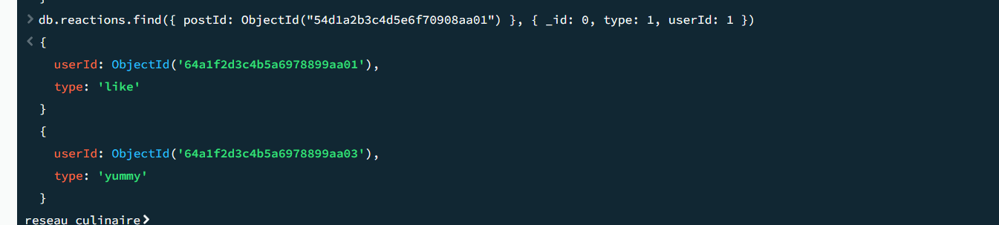


### Test de Neo4j

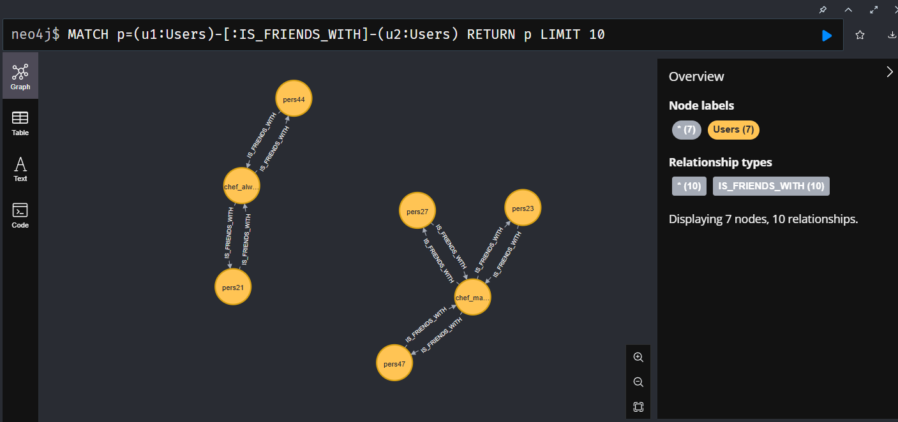
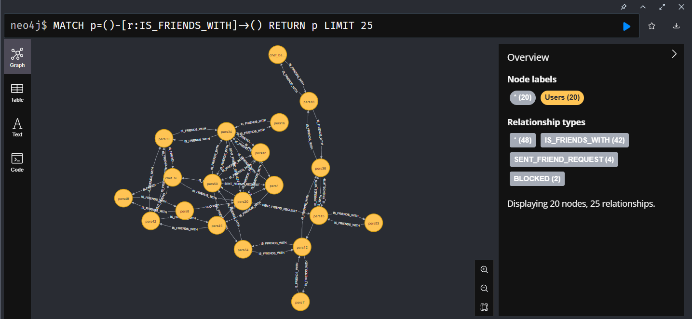
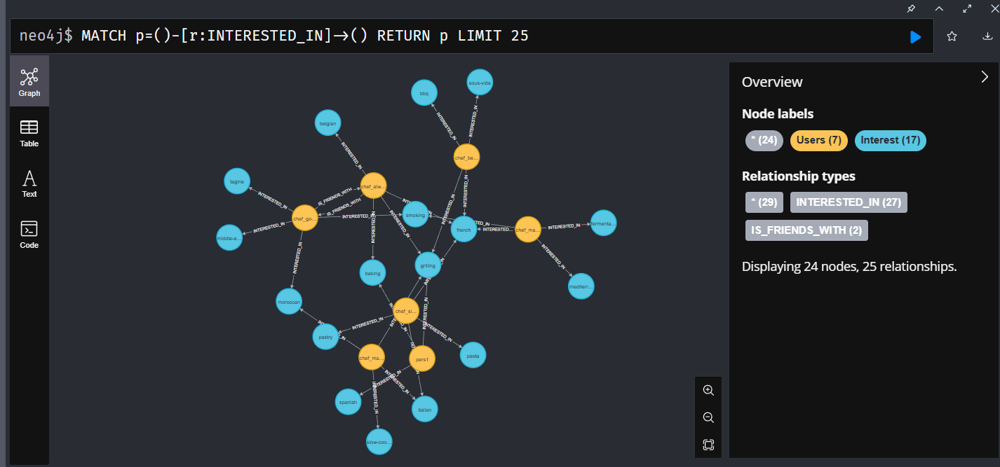

## 🗂️ Structure du dépôt

```
📦 projet-recommandation
├── utils/
│   ├── load_seeder.py          # Import Mongo -> Neo4j
│   ├── neo4j/connection.py     # Connexion Neo4j
│   ├── evaluation.py           # Fonctions d'évaluation
│   ├── mongodb/                # Données et scripts Mongo
│   └── donnees_mongo.json      # Fichier de seed
├── watcher/
│   └── sync_watcher.py         # Synchronisation Mongo ↔ Neo4j
├── docker-compose.yml
├── presentation.md
├── README.md
└── main.py                     # API Flask principale
```

---

## 🧰 Stack technique
| Composant | Usage |
|------------|--------|
| **Python 3.11** | API et scripts |
| **Flask** | Serveur REST |
| **PyMongo** | Connexion MongoDB |
| **Py2Neo** | Connexion Neo4j |
| **Docker Compose / Nomad** | Orchestration |
| **PlantUML** | Génération des schémas |

---
